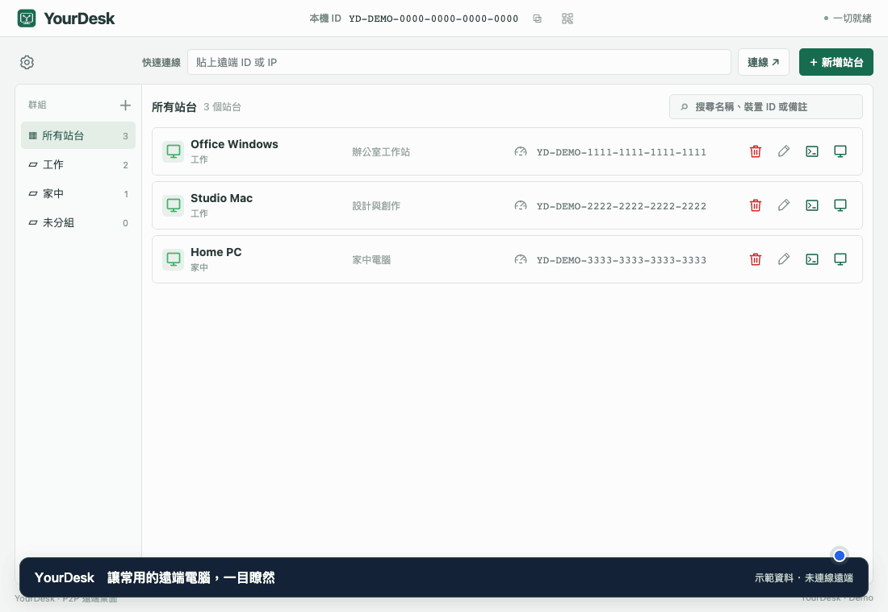

# YourDesk

**繁體中文** · [English](docs/README.en.md) · [日本語](docs/README.ja.md) · [한국어](docs/README.ko.md)

> **防毒偵測說明：目前部分防毒軟體會對 YourDesk 發出告警。我們測試的空 Go 專案也出現告警，Go 官方 FAQ 亦說明 Go 程式可能遭誤判；但目前尚未確認正式版的所有告警都是誤報。作者會持續調查與改善，朝消除這些告警的方向努力。請自行評估後下載使用，勿為此關閉防毒保護。**

YourDesk 是支援 macOS 與 Windows 的遠端桌面工具。從連線、站台管理到跨平台複製貼上，讓你在熟悉的操作方式中使用另一台電腦。

## 特色與功能

- **遠端桌面與命令列**：支援 GUI 與互動 CMD，可依工作選擇模式；命令列使用獨立視窗，亦可連入 Linux CLI Host。
- **獨立檔案傳輸**：macOS／Windows 以專用視窗瀏覽遠端家目錄、上傳與下載、建立目錄及確認後永久刪除；支援暫停、手動重連續傳及進度顯示，不需開啟遠端桌面或同步剪貼簿。可從系統拖入檔案／資料夾，單檔完整下載後可由原生區域拖出；[操作與限制](docs/FILE-TRANSFER.md)。
- **MCP AI Agent 遠端操控**：AI Agent 可透過 MCP 連線遠端、操作桌面或命令列、查詢站台能力，完成工作後斷線。
- **硬體編解碼加速**：支援 macOS H.264／HEVC 與 Windows H.264／AV1 正式硬體編碼路徑，Windows 另提供 H.264／HEVC／AV1 軟解；依兩端裝置能力自動選擇，無法使用時切換備援路徑，工具列可查看實際編解碼狀態。
- **跨平台遠端操作**：在 Mac 與 Windows 之間操作桌面，支援鍵盤、滑鼠與常用快捷鍵。
- **快速連線與站台管理**：輸入遠端 ID 即可連線，也能儲存常用站台、分組、拖曳排序及匯入／匯出。
- **跨電腦複製貼上**：支援文字、圖片、檔案與資料夾，可使用快捷鍵或系統右鍵貼上；檔案與資料夾每批最高 2 GiB。
- **多螢幕與彈性顯示**：工具列中央直接選擇遠端螢幕，最多顯示四個編號按鈕，選擇符合視窗、原始大小或全螢幕，並保留個人顯示設定。
- **畫面增強**：依使用情境選擇自動調整、畫面流暢優先或網路負載優先，也能調整 FPS 與碼率。
- **即時連線資訊**：工具列顯示 FPS、傳輸速率與增強狀態；站台旁的測速圖示可分析連線表現，提供簡短建議。
- **常駐與更新提醒**：關閉主視窗後仍可常駐系統匣，並定期提醒新版本。
- **多語言與外觀**：支援繁體中文、英文、日文、韓文，以及明亮／暗色主題。

## MCP：讓 AI Agent 操作遠端

AI Agent 可透過 MCP 建立遠端連線、取得畫面、操作鍵盤滑鼠、斷線、查詢連線診斷及調整設定。

IP 白名單預設開啟且只允許 `127.0.0.1`；名單內免 Token、名單外拒絕。關閉白名單時，所有來源皆須 Token。

本機入口為 `http://127.0.0.1:12345/mcp`。MCP 遠端畫面預設隱藏，Tray 會變色提示，並可從選單開啟或隱藏畫面。連線仍須正常密碼與系統權限。詳見 [MCP 設定與工具](docs/MCP.md)。

### 讓 AI Agent 能連線遠端的 Prompt

<table>
<tr><td><strong>請使用 YourDesk MCP（<code>http://127.0.0.1:12345/mcp</code>），白名單內免 Token；若需 Bearer 驗證，讀取本機 YourDesk 設定目錄內的 <code>mcp-token</code>，勿顯示 Token。請連到「站台名稱」，完成「操作內容」後斷線。</strong></td></tr>
</table>

## 下載與開始使用

從 [GitHub Releases](https://github.com/VaderChen/YourDesk/releases/latest) 下載最新版。

本文件介紹原始碼提供的功能；已發布安裝包實際包含的功能，請以對應發行說明為準。

| 平台 | 下載套件 |
| --- | --- |
| macOS Apple Silicon | 已簽章並通過 Apple 公證的 DMG |
| Windows x64 | Windows x64 安裝程式／免安裝 ZIP（完整解壓縮後執行 YourDesk.exe） |
| Windows on ARM（WOA） | Windows ARM64 安裝程式 |
| Linux x64／arm64 | CLI Host ZIP（無桌面／REMOTE） |

1. 在兩台電腦安裝並開啟 YourDesk。
2. 在快速連線輸入遠端 ID，或選擇已儲存的站台。
3. 輸入連線密碼後，即可開始操作遠端桌面。

macOS 使用遠端桌面時需允許「螢幕錄製」與「輔助使用」權限。透過剪貼簿接收遠端檔案時，若詢問「網路卷宗」存取，請允許；曾拒絕時可到「系統設定 → 隱私權與安全性 → 檔案與檔案夾」開啟 YourDesk 的網路卷宗權限，再重新複製檔案。Windows 需要 WebView2 Runtime。目前不支援 Intel Mac，亦未提供 Linux 桌面版。

也可使用 IP 直接連線；請先在被控端的「網路安全」設定中啟用。連線採加密直連，需要雙方網路允許直接連通。

## 畫面增強與補幀

畫面增強可減少傳輸畫面的負擔，再於本機放大顯示。依實際使用回饋，**遠端解析度越高，效益越明顯**，尤其是 1440p、4K 桌面。可選擇 FSR 或 Core ML，並依裝置支援情況切換模型。

實驗性 **2× 補幀**可讓動態畫面更流暢，目前限 Apple Silicon、macOS 13 以上。可選 Apple 低延遲或 RIFE；自動模式在支援的 macOS 27 以上裝置優先使用 Apple。畫面增強與補幀皆預設關閉，可在設定中自行開啟。效果依電腦與網路環境而異，快速移動或小字仍可能出現失真。

## 日常操作與更新

複製文字、圖片、檔案或資料夾後，切到另一端貼上即可。檔案與資料夾的貼上進度由系統顯示。

需要獨立管理檔案時，先結束該站台目前連線，再按 CMD 與 GUI 之間的檔案傳輸圖示。兩端須支援獨立檔案模式；此功能不包含 Android／iOS。傳輸支援暫停及斷線後手動續傳，但須保留雙端程式與傳輸視窗；不覆寫同名檔案、不合併既有目錄。刪除為永久操作，請先核對確認內容。完整操作、上限與平台驗收狀態見[桌面檔案傳輸](docs/FILE-TRANSFER.md)。

關閉遠端視窗會回到主畫面；關閉主畫面則繼續常駐。要完整結束程式，請使用系統匣選單的「關閉程式」，或在 macOS 按 Cmd+Q。

可在「關於」手動檢查更新。按下「下載並自動更新」後，下載完成會以紅字倒數 10 秒；期間可取消或按「立即更新」。倒數結束後自動結束程式、安裝新版並重新啟動；遠端連線會中斷。若無法自動安裝，可依提示手動安裝。建議兩端保持最新版，以使用完整功能。

## 更多資訊

- [連線測速與分析](docs/CONNECTION-DIAGNOSTICS.md) · [串流設定與相容性](docs/STREAMING-CONTROLS.md)
- [桌面檔案傳輸](docs/FILE-TRANSFER.md) · [遠端命令列](docs/TERMINAL.md)
- [建置與打包](docs/BUILD.md) · [架構說明](docs/ARCHITECTURE.md)
- [Android Viewer 建置與測試（開發中）](docs/ANDROID-BUILD.md) · [記憶體最佳化紀錄](docs/MEMORY-OPTIMIZATION-2026-09-19.md)
- [畫面增強模型](docs/QUICKSRNET.md) · [實驗性補幀](docs/FRAME-INTERPOLATION.md)

畫面處理使用 FSR、QuickSRNet／SESR 與 RIFE。感謝原作者提供相關技術；[FSR](docs/FSR-LICENSE.txt)、[超解析度模型](internal/superres/MODEL_LICENSE.txt)及 [RIFE](internal/frameinterp/MODEL_LICENSE.txt) 的完整授權亦隨套件附上。

**本版已修正近端 Mac 無法貼上遠端檔案的問題，使用者已確認恢復可用。**

## 遠端命令列

雙擊站台可選擇桌面或命令列；獨立檔案傳輸使用站台卡片上的專用圖示。命令列使用獨立視窗，可同時操作不同站台；舊版不支援時會提示更新。Linux 請以一般使用者執行，CLI 支援 `-secret "密碼"`，語系依 `LC_ALL → LC_MESSAGES → LANG` 選擇繁中、英、日、韓，不支援時使用英文。Linux ZIP 的 README 提供完整使用方式。

## 支持開發

如果 YourDesk 對你有幫助，歡迎請我喝杯咖啡，支持持續開發。

[☕ Buy Me a Coffee](https://buymeacoffee.com/vaderchen)

## 授權

Copyright (C) 2026 VaderChen.

本專案採[原始碼公開・禁止商業販售授權](LICENSE.md)：允許非販售的使用、修改及免費分享，包含公司內部自用；禁止販售、付費代管／SaaS、收費服務及付費產品整合，若有販售或付費產品／服務整合需求，可另行討論授權；取得另行書面授權前仍依本授權辦理。第三方元件依各自授權處理。此為自訂授權，不屬於 OSI 定義的開源授權。 一般員工薪資不算販售；以本軟體取得廣告、導購佣金或資料交易收入亦受限制。免費及內部整合須遵守完整授權。

完整授權：[繁體中文](LICENSE.md) · [English](LICENSE.en.md) · [日本語](LICENSE.ja.md) · [한국어](LICENSE.ko.md)
