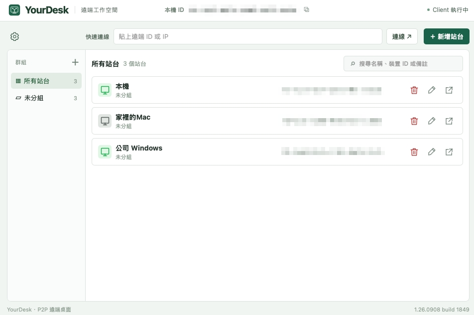

# YourDesk

[繁體中文](../README.md) · [English](README.en.md) · [日本語](README.ja.md) · **한국어**

YourDesk는 macOS와 Windows를 지원하는 원격 데스크톱 앱입니다. 연결 관리부터 복사와 붙여넣기까지, 익숙한 방식으로 다른 컴퓨터를 사용할 수 있습니다.

## 주요 기능

독립 터미널 창, Linux CLI x64/arm64 ZIP 및 MCP 대화형 터미널을 추가했습니다. 연결 해제 후 창 유지 여부를 설정할 수 있으며 Host 복구 대기는 회전 아이콘으로 표시합니다. [릴리스 노트](RELEASE-1.26.0911-build-2247.md).

- **GUI 및 명령줄 모드**: 작업에 따라 원격 데스크톱이나 대화형 터미널을 선택하세요. 터미널은 독립 창으로 열리며 Linux CLI Host에도 연결할 수 있습니다.
- **MCP AI Agent 원격 제어**: AI Agent가 MCP로 연결하여 데스크톱이나 터미널을 조작하고, 연결 대상의 기능을 조회한 뒤 작업을 마치면 연결을 해제할 수 있습니다.
- **하드웨어 인코딩·디코딩 가속**: macOS의 H.264/HEVC와 Windows의 H.264를 지원합니다. 양쪽 기기의 기능에 따라 자동 선택하고 사용할 수 없으면 대체 방식으로 전환하며, 도구 모음에서 실제 인코딩·디코딩 상태를 확인할 수 있습니다.
- **크로스 플랫폼 제어**: Mac과 Windows 사이에서 키보드, 마우스, 일반 단축키를 사용합니다.
- **빠른 연결과 관리**: 원격 ID로 연결하거나 저장된 연결을 선택합니다. 그룹, 순서 변경, 가져오기와 내보내기를 지원합니다.
- **복사와 붙여넣기**: 텍스트, 이미지, 파일과 폴더를 단축키나 우클릭으로 붙여넣습니다. 파일과 폴더는 한 번에 최대 2 GiB를 지원합니다.
- **유연한 화면 표시**: 도구 모음 중앙의 최대 4개 번호 버튼으로 원격 모니터 전환, 창에 맞추기, 원본 크기와 전체 화면을 지원합니다.
- **화면 향상**: 자동 조정, 부드러운 화면 우선, 네트워크 부하 우선 전략을 선택하고 FPS와 비트레이트를 조정합니다.
- **상태와 개인 설정**: FPS와 전송 속도, 즉시 표시되는 도움말, 밝고 어두운 테마, 4개 언어, 설정 저장과 업데이트 알림을 제공합니다.

## 새 기능: AI Agent용 MCP

AI Agent가 MCP를 통해 원격 연결, 화면 캡처, 키보드·마우스 제어, 연결 해제, 연결 진단 및 설정 변경을 수행할 수 있습니다.

IP 허용 목록은 기본으로 켜져 있고 `127.0.0.1`만 허용합니다. 목록 내 IP는 토큰이 필요 없고 나머지는 차단됩니다. 목록을 끄면 모든 연결에 토큰이 필요합니다.

로컬 주소는 `http://127.0.0.1:12345/mcp`입니다. 원격 화면은 기본적으로 숨겨지며 트레이 색상과 알림으로 조작 중임을 표시합니다. 트레이에서 화면을 표시하거나 숨길 수 있습니다. 일반 연결 인증과 OS 권한은 계속 필요합니다. [MCP 안내](MCP.md)를 참고하세요.

### AI Agent가 원격으로 연결하도록 하는 프롬프트

<table>
<tr><td><strong>YourDesk MCP(<code>http://127.0.0.1:12345/mcp</code>)를 사용하고 허용 목록 내에서는 토큰 없이 연결하며, Bearer 인증이 필요한 경우에만 로컬 YourDesk 설정의 <code>mcp-token</code>을 읽되 표시하지 마세요. “연결 이름”에 연결하여 “작업 내용”을 완료한 후 연결을 해제하세요.</strong></td></tr>
</table>

## 다운로드와 시작

[GitHub Releases](https://github.com/VaderChen/YourDesk/releases/latest)에서 macOS Apple Silicon용 DMG, Windows x64 또는 Windows ARM64 설치 프로그램을 받으세요. macOS 패키지는 서명 및 Apple 공증을 완료했습니다.

| 플랫폼 | 다운로드 패키지 |
| --- | --- |
| macOS Apple Silicon | 서명 및 Apple 공증 완료 DMG |
| Windows x64 | x64 설치 프로그램 |
| Windows on ARM (WOA) | ARM64 설치 프로그램 |
| Linux x64 / arm64 | CLI Host ZIP (데스크톱 / REMOTE 미포함) |

1. 두 컴퓨터에 YourDesk를 설치하고 실행합니다.
2. 원격 ID를 입력하거나 저장한 연결을 선택합니다.
3. 연결 암호를 입력하면 원격 제어를 시작할 수 있습니다.

macOS에서는 화면 기록과 손쉬운 사용 권한이 필요합니다. Windows에는 WebView2 Runtime이 필요합니다. Intel Mac과 Linux 데스크톱 버전은 지원하지 않습니다. 원격 컴퓨터에서 활성화하면 IP 직접 연결도 가능합니다. 연결은 암호화되며 직접 통신이 가능한 네트워크가 필요합니다.

## 화면 향상과 보간

전송할 화면을 줄이고 로컬에서 확대해 전송 부담을 낮춥니다. 사용자 경험에 따르면 특히 1440p와 4K처럼 원격 해상도가 높을수록 효과가 커집니다. 장치 지원에 따라 FSR 또는 Core ML을 선택할 수 있습니다.

실험적 **2× 보간**은 Apple Silicon과 macOS 13 이상에서 지원합니다. Apple 저지연 보간 또는 RIFE를 선택할 수 있습니다. 자동 모드는 macOS 26 이상을 실행하는 지원 Mac에서 Apple을 우선 사용합니다. 화면 향상과 보간은 기본적으로 꺼져 있습니다. 효과는 환경에 따라 다르며 빠른 움직임이나 작은 글자에서 왜곡이 나타날 수 있습니다.

## 일상 사용과 업데이트

한 컴퓨터에서 복사하고 다른 컴퓨터에 붙여넣으세요. 파일 붙여넣기 진행 상황은 운영체제가 표시합니다. 원격 창을 닫으면 메인 화면으로 돌아가며, 메인 화면을 닫으면 트레이에 상주합니다. 완전히 종료하려면 트레이의 종료 메뉴 또는 macOS의 Cmd+Q를 사용하세요.

정보 화면에서 업데이트를 확인할 수 있습니다. 다운로드 후 빨간색으로 10초를 카운트다운하며 취소하거나 즉시 업데이트할 수 있습니다. 시간이 끝나면 앱을 종료하고 업데이트를 설치한 뒤 자동으로 다시 시작합니다. 자동 설치에 실패하면 안내에 따라 수동으로 설치하세요.

## 자세한 정보

[스트리밍 설정](STREAMING-CONTROLS.md) · [빌드](BUILD.md) · [구조](ARCHITECTURE.md) · [모델](QUICKSRNET.md) · [보간](FRAME-INTERPOLATION.md)

FSR, QuickSRNet/SESR, RIFE 제작자에게 감사드립니다. [FSR](FSR-LICENSE.txt), [초해상도 모델](../internal/superres/MODEL_LICENSE.txt), [RIFE](../internal/frameinterp/MODEL_LICENSE.txt)의 전체 라이선스는 배포 패키지에도 포함됩니다.

**클립보드 동기화 개선: 사용자가 실제 기기에서 Mac 간 텍스트, 이미지 및 양방향 파일 복사가 가능함을 확인했습니다.**

## 원격 터미널

데스크톱 또는 터미널을 선택하거나 연결을 더블 클릭하여 모드를 선택하세요. 독립 창으로 여러 연결을 사용할 수 있고 미지원 구버전에는 업데이트 안내가 표시됩니다. Linux는 일반 사용자로 실행하세요. `-secret "암호"`를 지원하며 `LC_ALL → LC_MESSAGES → LANG`에 따라 번체 중국어, 영어, 일본어, 한국어를 선택합니다. 미지원 언어는 영어로 표시합니다. 사용법은 ZIP의 README를 확인하세요.

## 개발 후원

YourDesk가 도움이 되었다면 커피 한 잔으로 지속적인 개발을 응원해 주세요.

[☕ Buy Me a Coffee](https://buymeacoffee.com/vaderchen)

## 라이선스

Copyright (C) 2026 VaderChen.

이 프로젝트는 이중 라이선스를 적용합니다. 오픈 소스 사용에는 [GNU GPL v3.0 only](../LICENSE) (`GPL-3.0-only`)가 적용되며 다른 조건이 필요한 경우 별도의 [상업용 라이선스](../COMMERCIAL-LICENSE.md)를 협의할 수 있습니다. 타사 구성 요소에는 각자의 라이선스가 적용됩니다.
